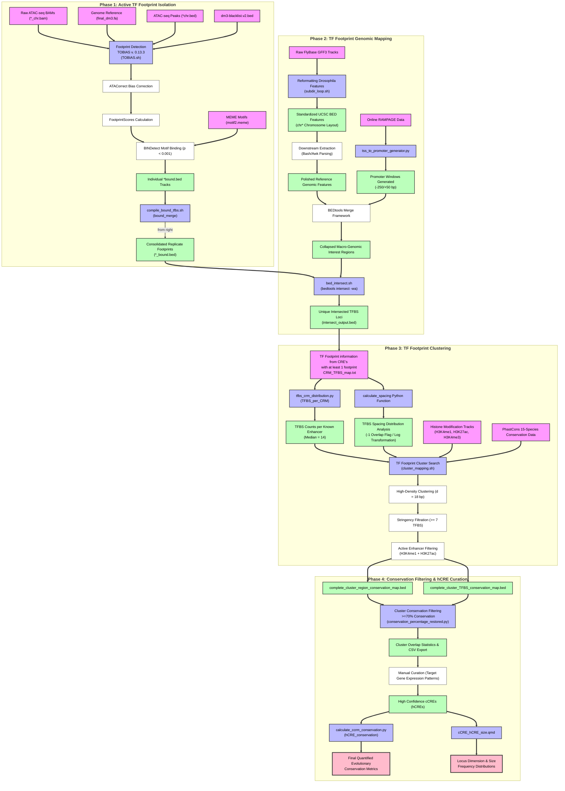

# Pipeline for "Novel Drosophila cis-regulatory elements can be uncovered by footprinting transcription factor binding sites in ATAC-seq data"

This repository contains a complete pipeline for processing genomic datasets in *Drosophila melanogaster* to detect transcription factor (TF) footprints in previously published ATAC-seq data. We perform a genome-wide mapping of these TF footprints and even search for novel cis-regulatory elements from TF footprint clusters filtered by cluster size, active enahncer epigenetic signatures, evolutionary conservation across 15 species (PhastCons 15).

---

## Workflow Architecture

---
## Adapting this Pipeline

To adapt this pipeline for your own use, you will need to change parts of each script manually:
- Path files
- What kind of BEDtools intersect option you want to use in bed_intersect.sh
- TF footprint clustering thresholds in cluster_mapping.sh

